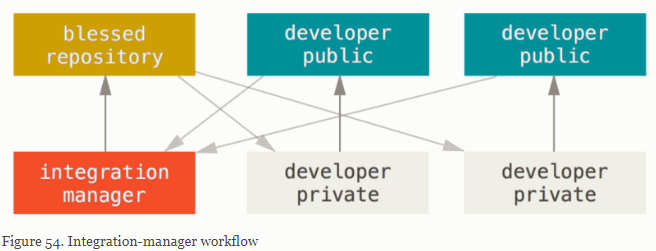
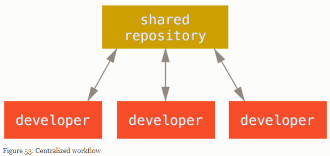
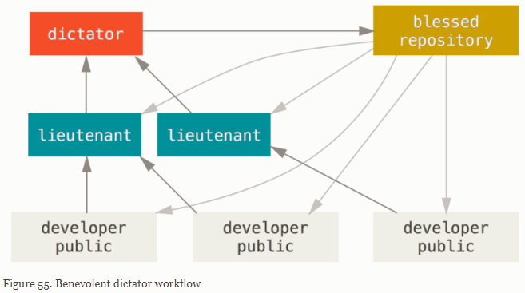

# Using Gitlab/Github

## Workflow (copied from *Git Pro*)

### Integration-Manager Workflow

Each developer has write access to their own public repository and read access to everyone else’s. This scenario often includes a canonical repository that represents the "official" project. To contribute to that project, you create your own public clone of the project and push your changes to it. Then, you can send a request to the maintainer of the main project to pull in your changes. The maintainer can then add your repository as a remote, test your changes locally, merge them into their branch, and push back to their repository. The process works as follows (see Integration-manager workflow):

1. The project maintainer pushes to their public repository.
1. A contributor clones that repository and makes changes.
1. The contributor pushes to their own public copy.
1. The contributor sends the maintainer an email asking them to pull changes.
1. The maintainer adds the contributor’s repository as a remote and merges locally.
1. The maintainer pushes merged changes to the main repository.

### Centralized Workflow

Set up a single repository, and give everyone on your team push access; Git won’t let users overwrite each other.

### Dictator and Lieutenants Workflow

Various integration managers are in charge of certain parts of the repository; they’re called lieutenants. All the lieutenants have one integration manager known as the benevolent dictator. The benevolent dictator pushes from their directory to a reference repository from which all the collaborators need to pull. The process works like this (see Benevolent dictator workflow):

1. Regular developers work on their topic branch and rebase their work on top of master. The master branch is that of the reference repository to which the dictator pushes.
1. Lieutenants merge the developers' topic branches into their master branch.
1. The dictator merges the lieutenants' master branches into the dictator’s master branch.
1. Finally, the dictator pushes that master branch to the reference repository so the other developers can rebase on it.

